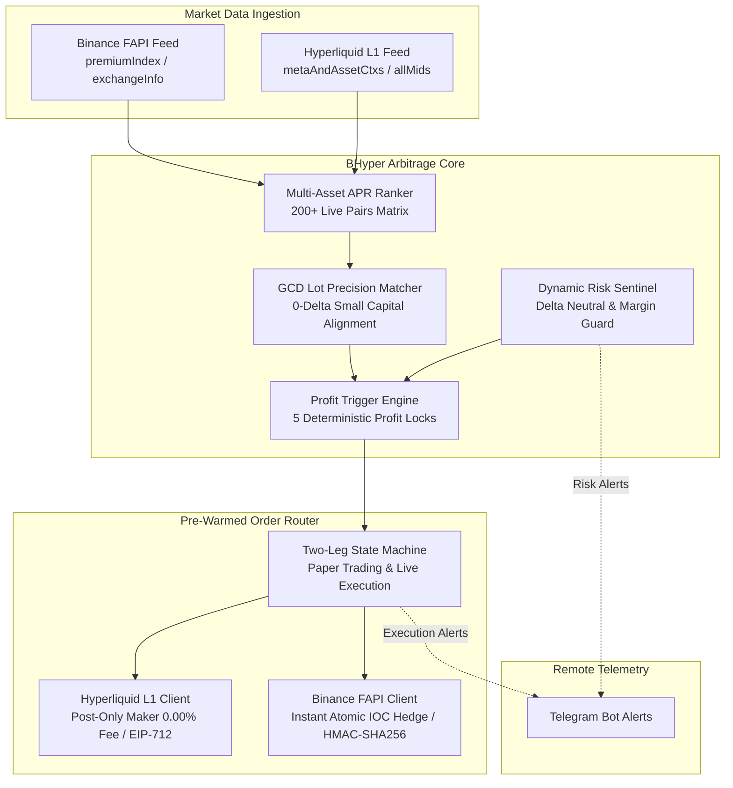

<div align="center">

# ⚡ BHyper

**Ultra Low-Latency Binance × Hyperliquid Cross-Exchange Funding Rate & Basis Arbitrage Engine**

[](https://github.com/d3intran/bhyper/actions/workflows/ci.yml)
[](LICENSE-MIT)
[](https://www.rust-lang.org)
[]()

*A deterministic, delta-neutral, high-frequency arbitrage framework built in pure Rust for quantitative traders and small-capital agility ($50 - $500).*

[English](#features) | [中文说明](#核心特性-chinese) | [Architecture](#architecture) | [Quickstart](#quickstart) | [Full Blueprint](PLAN.md)

</div>

---

## 🌟 Highlights

- **⚡ Sub-Millisecond Pure Rust Engine**: Zero-GC, persistent HTTP keep-alive connection pools, and hardware-accelerated EIP-712 / HMAC-SHA256 signing (`alloy-primitives` / `k256` / `ring` / `sha3` / `rmp-serde`).
- **📊 Real-Time Multi-Asset APR Normalization**: Continuously scans and matches 200+ perpetual contracts between Binance FAPI (8h interval) and Hyperliquid L1 (1h interval).
- **🎯 5 Profitability Locks & Timing Sniper**: Enforces VWAP depth calculations, entry basis cushion guards, and pre-settlement execution windows (T - 45s ~ T - 10s) ensuring positive expected returns on every single trade.
- **🛡️ Small-Capital Protection & GCD Lot Precision Alignment ($50 ~ $100 Ready)**: Specifically engineered GCD precision matching algorithm eliminating lot step-size truncation risks, exchange minimum notional constraints ($12 buffer), and multi-leg orphan exposure.
- **🧪 Safe Paper Trading (Dry-Run) & Live Execution Engine**: Automated two-leg Maker-Taker hedging state machine with orphan leg emergency unwind protection.
- **📲 Remote Telegram Telemetry**: Automated Telegram alert dispatching for arbitrage triggers, live margin health, and hourly funding disbursements.

---

## 🏗️ Architecture



---

## 🚀 Quickstart

### 1. Installation & Build

Ensure you have Rust installed (`curl --proto '=https' --tlsv1.2 -sSf https://sh.rustup.rs | sh`):

```bash
# Clone the repository
git clone https://github.com/d3intran/bhyper.git
cd bhyper

# Build optimized release binary
cargo build --release
```

### 2. Live Market Scanner (Zero-Config Required)

Scan live funding rate spreads across all 200+ shared pairs without API keys:

```bash
./target/release/bhyper scan --limit 20
```

### 3. GCD Lot Precision Alignment Analysis

Inspect small-capital precision compatibility across all shared pairs:

```bash
./target/release/bhyper precision --limit 15 --target-usd 50
```

### 4. Deterministic Profit Trigger Evaluation

Evaluate live opportunities through the 5 Profitability Locks & Lot Precision Matcher:

```bash
# Evaluate with $50 margin allocation
./target/release/bhyper trigger --margin-usd 50

# Evaluate bypassing the pre-settlement hourly window (for inspection)
./target/release/bhyper trigger --margin-usd 50 --ignore-window
```

### 5. Automated Arbitrage Execution Engine (Paper Trading & Live)

```bash
# Run Safe Paper Trading Simulation Mode (Default)
./target/release/bhyper trade --margin-usd 50 --dry-run true

# Run Live Trading Mode (Requires explicit --live-danger flag and funded API keys)
./target/release/bhyper trade --margin-usd 50 --live-danger
```

### 6. Emergency Manual Unwinding

Instantly close positions on both exchanges simultaneously:

```bash
./target/release/bhyper unwind --symbol SAGA
```

---

## 🇨🇳 核心特性 (Chinese)

- **⚡ 纯 Rust 亚毫秒级低延迟架构**：零垃圾回收停顿，长连接连接池保持，纳秒级无分配数据流。
- **📊 全币种实时费率归一化矩阵**：精准对齐币安 8 小时与 Hyperliquid 1 小时结算周期，以年化收益率（APR）实时排序。
- **🎯 5 重确定性盈利锁与整点狙击**：结合盘口全深度 VWAP 计算与整点前 45 秒窗口狙击，确保单次操作覆盖双向手续费与滑点磨损。
- **🛡️ GCD 步长对齐与小资金保护机制（$50 ~ $100 初始本金优化）**：内置 `LotPrecisionMatcher` 算法，严格对齐币安 `stepSize` 与 Hyperliquid `szDecimals`，实现 100% 零 Delta 漂移。
- **🧪 模拟盘（Paper Trading）与实盘原子对冲引擎**：提供安全的模拟盘演练；实盘支持 Hyperliquid Post-Only Maker 挂单与币安秒级 IOC 对冲，并内置孤儿腿紧急平仓熔断。
- **📲 Telegram 实时监控与远程预警**：发现高利润机会、完成建仓平仓与风控异常即刻推送。

---

## 📈 Mathematics & Profit Model

For complete theoretical derivations, economic break-even horizon equations, EIP-712 signature benchmarks, and low-latency Linux kernel tuning, see **[PLAN.md](PLAN.md)**.

---

## 📜 License

Licensed under either of:

- Apache License, Version 2.0 ([LICENSE-APACHE](LICENSE-APACHE) or http://www.apache.org/licenses/LICENSE-2.0)
- MIT license ([LICENSE-MIT](LICENSE-MIT) or http://opensource.org/licenses/MIT)

at your option.
