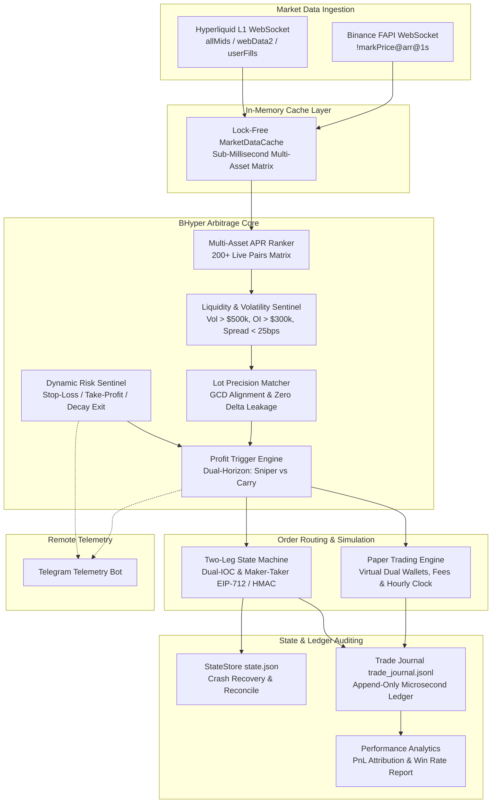

<div align="center">

# ⚡ BHyper 2.0

**Institutional High-Performance Binance × Hyperliquid Cross-Exchange Funding Rate & Basis Arbitrage Engine**

[](https://github.com/d3intran/bhyper/actions/workflows/ci.yml)
[](LICENSE-MIT)
[](https://www.rust-lang.org)
[]()

*A zero-allocation, delta-neutral, sub-millisecond arbitrage framework written in pure Rust for quantitative traders, automated hedge funds, and small-capital agility ($50 - $5,000).*

[English](#-highlights) | [中文说明](#-核心特性-chinese) | [Mathematical Models](#-core-mathematical-models) | [Architecture](#%EF%B8%8F-architecture) | [Quickstart](#-quickstart) | [CLI Reference](#-cli-command-reference)

</div>

---

## 🌟 Highlights

- **⚡ Sub-Millisecond Pure Rust WebSocket Core**: Real-time dual WebSocket ingestion (`wss://fstream.binance.com` + `wss://api.hyperliquid.xyz`), in-memory lock-free `MarketDataCache`, and hardware-accelerated EIP-712 / HMAC-SHA256 crypto providers (`k256` / `ring` / `sha3` / `rmp-serde`).
- **📊 Asymmetric Funding Normalization (8h vs 1h)**: Accurately reconciles Binance (8h epoch: 00:00, 08:00, 16:00 UTC) and Hyperliquid (1h top-of-hour: XX:00:00 UTC) settlement cycles, projecting 1h, 4h, and 8h net cashflows.
- **🎯 Dual-Horizon Arbitrage Engine**:
  - **T-60s Hourly Sniper Mode**: Pre-settlement entry window (T - 60s ~ T - 10s) with Post-Only Maker and instant Taker hedging, harvesting 1h funding and exiting on spread compression.
  - **24h+ Multi-Day Carry Mode**: Holds high-yielding structural spreads with Fee-Amortization Lock, amortizing entry/exit friction across multiple settlement cycles.
- **🛡️ 5 Deterministic Profitability Locks & Liquidity Sentinels**: Dynamic VWAP slippage bounds, rate manipulation divergence locks (<0.6%), minimum 24h volume ($500k), and minimum open interest ($300k) prevent adverse selection.
- **📐 Small-Capital Precision Matching ($50 ~ $500 Ready)**: Built-in `LotPrecisionMatcher` calculating greatest common divisor (GCD) step-sizes between Binance `stepSize` and Hyperliquid `szDecimals`, eliminating lot truncation risks and naked Delta exposure.
- **🔢 Strict Hyperliquid 5 Significant Figures Formatter**: Full compliance with Hyperliquid L1 order matching rules (max 5 significant figures, max 6 decimals, integer pricing >= 100,000).
- **🧪 Production-Grade Paper Trading Engine**: Double-entry virtual dual wallets, realistic Maker/Taker fee deduction, margin allocation, and deterministic UTC top-of-hour funding cashflow accrual.
- **📖 Append-Only Trade Journal Ledger (`trade_journal.jsonl`)**: Comprehensive audit trail recording all trading lifecycle events (`INTENT`, `OPEN_FILL`, `FUNDING`, `CLOSE_FILL`, `RISK_ALERT`, `ORPHAN_UNWIND`) with microsecond timestamps.
- **📈 Quantitative Performance & PnL Attribution Analytics**: Institutional metrics reporting Win Rate, Profit Factor, Net Realized PnL, Gross Funding vs Basis PnL, Total Roundtrip Fees, and Maximum Drawdown with Markdown export.
- **⚖️ Cross-Exchange Margin Health & Rebalance Advisory**: Real-time margin balance monitoring and capital transfer recommendations across Binance and Hyperliquid.
- **📲 Remote Telegram Telemetry**: Instant alert dispatching for arbitrage triggers, automated position executions, margin health warnings, and funding disbursements.

---

## 🧮 Core Mathematical Models

### 1. Asymmetric Funding Rate Normalization

Binance perpetual futures settle funding every **8 hours** (00:00, 08:00, 16:00 UTC), while Hyperliquid perps settle every **1 hour** (XX:00:00 UTC). BHyper annualizes both into normalized APR:

$$\text{APR}_{\text{Binance}} = r_{8\text{h}} \times 3 \times 365 \times 100\% = r_{8\text{h}} \times 1095 \times 100\%$$

$$\text{APR}_{\text{Hyperliquid}} = r_{1\text{h}} \times 24 \times 365 \times 100\% = r_{1\text{h}} \times 8760 \times 100\%$$

$$\text{Net Spread APR} = \left| \text{APR}_{\text{HL}} - \text{APR}_{\text{BN}} \right|$$

### 2. Projected Multi-Horizon Net Cashflow

For an opportunity with Hyperliquid rate $r_{\text{HL, 1h}}$ and Binance rate $r_{\text{BN, 8h}}$, let $\text{Cost}_{\text{friction}}$ be total roundtrip trading fees and slippage:

$$\text{Cashflow}_{\text{HL, 1h}} = \text{Side}_{\text{HL}} \times r_{\text{HL, 1h}} \times 10^4 \quad (\text{bps})$$

$$\text{Cashflow}_{\text{BN, 8h}} = \text{Side}_{\text{BN}} \times r_{\text{BN, 8h}} \times 10^4 \quad (\text{bps})$$

$$\text{Projected 1h Net} = \text{Cashflow}_{\text{HL, 1h}} + \mathbf{1}_{\text{BN settlement next}} \cdot \text{Cashflow}_{\text{BN, 8h}} - \text{Cost}_{\text{friction}}$$

$$\text{Projected 4h Net} = 4 \times \text{Cashflow}_{\text{HL, 1h}} + \mathbf{1}_{\text{BN settlement next}} \cdot \text{Cashflow}_{\text{BN, 8h}} - \text{Cost}_{\text{friction}}$$

$$\text{Break-Even Duration (hours)} = \frac{\text{Cost}_{\text{friction}}}{\text{Hourly Return (bps)}}$$

### 3. GCD Lot Precision Alignment (Zero-Delta Small Capital Sizing)

Given target nominal margin $U_{\text{target}}$ and mark price $P_{\text{mark}}$, the raw order quantity is $Q_{\text{raw}} = U_{\text{target}} / P_{\text{mark}}$.

To prevent naked Delta exposure from exchange rounding differences:
1. Binance discrete step: $Q_{\text{BN}} = \lfloor Q_{\text{raw}} / \text{stepSize} \rfloor \times \text{stepSize}$
2. Hyperliquid discrete step: $Q_{\text{HL}} = \lfloor Q_{\text{raw}} \times 10^{\text{szDecimals}} \rfloor / 10^{\text{szDecimals}}$
3. Aligned Quantity: $Q_{\text{aligned}} = \min(Q_{\text{BN}}, Q_{\text{HL}})$ rounded to $\min(\text{decimals}(\text{stepSize}), \text{szDecimals})$
4. Strict Delta Drift Check: $|Q_{\text{BN, formatted}} - Q_{\text{HL, formatted}}| \times P_{\text{mark}} \le 0.01\% \cdot U_{\text{target}}$

---

## 🏗️ Architecture



---

## 🚀 Quickstart

### 1. Installation & Build

Ensure you have Rust 1.75+ installed:

```bash
# Clone the repository
git clone https://github.com/d3intran/bhyper.git
cd bhyper

# Build optimized release binary
cargo build --release
```

### 2. Market Scanner & Live Opportunity Matrix

Scan real-time funding rate differentials and projected net returns across 200+ crypto perpetual pairs:

```bash
./target/release/bhyper scan --limit 20
```

### 3. Real-Time WebSocket Streaming Dashboard

Run the sub-second live market data stream:

```bash
./target/release/bhyper stream --limit 15
```

### 4. Precision & Small-Capital Lot Sizing

Inspect GCD precision compatibility for small capital ($50 ~ $500):

```bash
./target/release/bhyper precision --limit 15 --target-usd 50
```

### 5. Deterministic Profit Trigger Evaluation

Evaluate opportunities against all 5 profit locks:

```bash
# Test with $50 margin allocation
./target/release/bhyper trigger --margin-usd 50

# Bypass pre-settlement timing window for testing
./target/release/bhyper trigger --margin-usd 50 --ignore-window
```

### 6. Full Simulation & Paper Trading Daemon

Run the autonomous 24/7 paper trading daemon with continuous WebSocket streaming and deterministic UTC top-of-hour funding accrual:

```bash
# Run continuous paper trading daemon ($500 virtual capital, $100 per trade)
./target/release/bhyper paper --initial-capital 500 --margin-usd 100 --interval-secs 2
```

### 7. Interactive Manual Paper Trading

Test simulated order open & close lifecycles on demand:

```bash
# Manually open a simulated arbitrage position on SUI
./target/release/bhyper paper-trade --symbol SUI --margin-usd 50 --action open

# Manually close the simulated position on SUI
./target/release/bhyper paper-trade --symbol SUI --action close

# Reset paper trading balance to $500
./target/release/bhyper reset-paper --initial-capital 500
```

### 8. Trade Execution Journal & Performance Audit

Inspect the append-only chronological ledger and quantitative PnL attribution report:

```bash
# View recent execution journal ledger entries
./target/release/bhyper journal --limit 20

# Filter journal by symbol or event type
./target/release/bhyper journal --symbol SUI --event FUNDING

# Generate comprehensive quantitative performance report
./target/release/bhyper report --initial-capital 500 --export-md ./reports/summary.md
```

### 9. Cross-Exchange Margin Health & Rebalance Advisory

```bash
# Check margin health and capital rebalance suggestions
./target/release/bhyper health

# Audit on-exchange live positions against local state store
./target/release/bhyper reconcile
```

---

## 💻 CLI Command Reference

| Command | Description | Example |
| :--- | :--- | :--- |
| `scan` | Scan live funding rate opportunities across Binance and Hyperliquid | `bhyper scan --limit 20` |
| `stream` | Real-time WebSocket terminal dashboard (sub-second refresh) | `bhyper stream --limit 15` |
| `precision` | Inspect GCD lot precision and minimum notional alignment | `bhyper precision --target-usd 50` |
| `trigger` | Test opportunity feasibility against 5 profit locks | `bhyper trigger --margin-usd 50` |
| `check` | Verify Binance API & Hyperliquid L1 connectivity and balances | `bhyper check` |
| `positions` | Inspect currently open live positions in local state store | `bhyper positions` |
| `health` | Cross-exchange margin health and capital rebalance advisory | `bhyper health` |
| `reconcile` | Audit on-exchange live positions against local state store | `bhyper reconcile` |
| `monitor` | Launch live rate monitoring daemon with Telegram alerts | `bhyper monitor --interval-secs 10` |
| `trade` | Execute live two-leg arbitrage (requires `--live-danger`) | `bhyper trade --margin-usd 50 --live-danger` |
| `paper` | Run 24/7 continuous autonomous paper trading simulation daemon | `bhyper paper --initial-capital 500` |
| `journal` | Inspect chronological append-only trade execution ledger | `bhyper journal --limit 30` |
| `report` | Generate institutional quantitative review and PnL attribution | `bhyper report --initial-capital 500` |
| `reset-paper`| Reset virtual paper trading wallet to fresh initial capital | `bhyper reset-paper --initial-capital 500` |
| `paper-trade`| Manually execute single simulated open or close action | `bhyper paper-trade --symbol SUI --action open` |
| `unwind` | Emergency unwind and close open position on both exchanges | `bhyper unwind --symbol SAGA` |
| `web` | Launch embedded Web Dashboard & Telegram Mini App Server | `bhyper web --port 8080` |
| `config` | Display active configuration and config file path | `bhyper config` |

---

## ⚙️ Configuration (`config.toml`)

Copy `config.example.toml` to `config.toml` (or `~/.config/bhyper/config.toml`):

```toml
# ==============================================================================
# ⚡ BHyper: Binance x Hyperliquid Funding Rate Arbitrage Engine Configuration
# ==============================================================================

[binance]
api_key = "YOUR_BINANCE_API_KEY"
api_secret = "YOUR_BINANCE_API_SECRET"
base_url = "https://fapi.binance.com"

[hyperliquid]
private_key = "YOUR_HL_ETHEREUM_PRIVATE_KEY"
wallet_address = "YOUR_HL_WALLET_ADDRESS"
base_url = "https://api.hyperliquid.xyz"
is_testnet = false

[strategy]
min_open_apr_pct = 25.0          # Minimum Net Spread APR to trigger trade (e.g. 25%)
min_carry_apr_pct = 25.0         # Minimum APR for 24h+ Carry mode entry
min_exit_apr_pct = 5.0           # Exit threshold when spread compresses (e.g. 5%)
max_position_usd_per_pair = 120.0 # Max notional size per pair (optimized for $500 capital)
max_active_positions = 3         # Max concurrent active pairs (3 slots)
max_holding_hours = 12.0         # Max holding time before time-decay exit
stop_loss_basis_bps = 40.0       # Max basis divergence loss allowed in bps (0.40%)
take_profit_basis_bps = 15.0     # Basis convergence take-profit threshold in bps (0.15%)
leverage = 2.0                   # Conservative leverage (2x ~ 3x)
maker_taker_mode = true          # Post-only Maker on HL + Instant Taker on Binance
max_slippage_bps = 15.0          # Max acceptable slippage in bps (0.15%)
auto_unwind_on_decay = true      # Automatically unwind position when spread compresses
fee_amortization_lock = true     # Do not exit on decay unless funding covers exit friction
dual_horizon_mode = true         # Support both 24h+ carry and hourly sniper modes
min_open_interest_usd = 300000.0 # Minimum OI ($300k)
min_24h_volume_usd = 500000.0    # Minimum 24h Volume ($500k)
max_bid_ask_spread_bps = 25.0    # Maximum allowable spread (25 bps)
max_oracle_mark_divergence_pct = 0.6 # Max Oracle deviation (0.6%)
use_binance_ws_api = true        # Use Zero-HTTP WebSocket API for sub-ms order execution

[risk]
max_delta_drift_pct = 3.0        # Max allowed delta imbalance before rebalancing (3%)
min_margin_ratio_pct = 25.0      # Liquidation safety buffer threshold
max_total_notional_usd = 360.0   # Max total portfolio notional ($140 buffer on $500 capital)
auto_rebalance_delta = true      # Automatically balance orphan legs
stop_loss_basis_bps = 40.0       # Hard basis loss stop-loss in bps
take_profit_basis_bps = 15.0     # Take profit in bps
max_holding_hours = 12.0         # Maximum duration limit (hours)
min_exit_apr_pct = 5.0           # Minimum spread APR exit line
fee_amortization_lock = true     # Fee amortization protection
max_margin_utilization_pct = 75.0 # Margin utilization threshold
min_liquidation_distance_pct = 20.0 # Liquidation distance threshold
rebalance_threshold_imbalance_pct = 40.0

[telegram]
bot_token = "YOUR_TELEGRAM_BOT_TOKEN"
chat_id = 123456789
alerts_enabled = true
```

---

## 🇨🇳 核心特性 (Chinese)

- **⚡ 极速 Rust WebSocket 双所直连**：亚毫秒级处理币安 `!markPrice@arr@1s` 与 Hyperliquid `allMids` 全量行情流，内存无锁高性能运算，微秒级 EIP-712 与 HMAC 硬件签名。
- **📊 8h / 1h 跨交易所结算排期智能归一化**：精准处理币安 8 小时大周期与 Hyperliquid 1 小时整点周期的非对称结算，动态计算 1h、4h、8h 多持仓周期净现金流。
- **🎯 双时间视界套利模式 (Dual-Horizon Mode)**：
  - **T-60s 整点狙击 (Sniper Mode)**：整点前 10s~60s 触发建仓，吃满 Hyperliquid 单期 1h 费率后快速平仓，资金周转率极高。
  - **24h+ 长效持仓 (Carry Mode)**：针对结构性高利差交易对持续收取资金费，配合保本锁（Fee-Amortization Lock）摊薄进出场摩擦。
- **🛡️ 机构级流动性与防插针风控哨兵**：内置 24h 成交额（$500k）、持仓量 OI（$300k）、买卖盘口价差（25 bps）与预言机偏离锁（<0.6%），彻底杜绝费率突变与操纵风险。
- **📐 GCD 步长对齐与小资金保护机制（$50 ~ $500 本金适配）**：内置 `LotPrecisionMatcher` 算法，严格对齐币安 `stepSize` 与 Hyperliquid `szDecimals`，实现 100% 零 Delta 漂移。
- **🔢 严格遵循 Hyperliquid 5 位有效数字规范**：精确计算数量级与保留小数位，自动处理 `>= 100,000` 整数定价，杜绝 `Price has too many significant figures` 报错。
- **🧪 工业级模拟盘环境与全息交易流水账本**：
  - 双所虚拟钱包管理（支持资金划拨与 Maker/Taker 费率真实扣减）。
  - 支持 7×24 小时后台守护挂载（`bhyper paper`）与交互式单笔即时测试（`bhyper paper-trade`）。
  - 基于真实 UTC 整点钟声（`XX:00:00 UTC`）进行确定性资金费现金流记账，零时钟漂移。
  - 追加写入式交易流水账本 `trade_journal.jsonl`，详尽记录 `INTENT`、`OPEN_FILL`、`FUNDING`、`CLOSE_FILL` 全生命周期事件。
  - 一键生成机构级量化复盘报告（`bhyper report`），清晰拆解资金费收入（Gross Funding）、基差损益（Basis PnL）、交易手续费（Fees）与胜率。
- **⚖️ 跨所保证金健康度诊断与调仓建议**：实时评估两所保证金分布，生成最优调仓建议。
- **📲 Telegram 实时监控与远程预警**：开平仓、利差衰减平仓、整点资金费到账实时推送到群聊。

---

## 📜 License

Licensed under either of:

- Apache License, Version 2.0 ([LICENSE-APACHE](LICENSE-APACHE) or http://www.apache.org/licenses/LICENSE-2.0)
- MIT license ([LICENSE-MIT](LICENSE-MIT) or http://opensource.org/licenses/MIT)

at your option.
