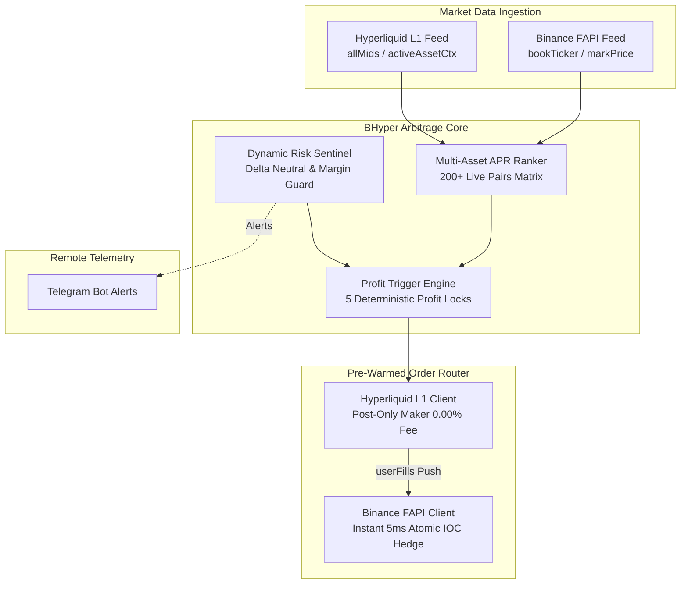

<div align="center">

# ⚡ BHyper

**Ultra Low-Latency Binance × Hyperliquid Cross-Exchange Funding Rate & Basis Arbitrage Engine**

[](https://github.com/d3intran/bhyper/actions/workflows/ci.yml)
[](LICENSE-MIT)
[](https://www.rust-lang.org)
[]()

*A deterministic, delta-neutral, high-frequency arbitrage framework built in pure Rust for quantitative traders and small-capital agility.*

[English](#features) | [中文说明](#核心特性-chinese) | [Architecture](#architecture) | [Quickstart](#quickstart) | [Full Blueprint](PLAN.md)

</div>

---

## 🌟 Highlights

- **⚡ Sub-Millisecond Pure Rust Engine**: Zero-GC, lock-free concurrency, persistent HTTP keep-alive connection pools, and hardware-accelerated EIP-712 / HMAC-SHA256 signing (`alloy-primitives` / `k256` / `ring`).
- **📊 Real-Time Multi-Asset APR Normalization**: Continuously scans and matches 200+ perpetual contracts between Binance FAPI (8h interval) and Hyperliquid L1 (1h interval).
- **🎯 5 Profitability Locks & Timing Sniper**: Enforces VWAP depth calculations, entry basis cushion guards, and pre-settlement execution windows (T - 45s ~ T - 10s) ensuring positive expected returns on every single trade.
- **🛡️ Small-Capital Protection Framework ($100 Ready)**: Specifically engineered to avoid lot step-size truncation risks, exchange minimum notional constraints, and multi-leg orphan exposure.
- **📲 Remote Telegram Telemetry**: Automated Telegram alert dispatching for arbitrage triggers, live margin health, and hourly funding disbursements.

---

## 🏗️ Architecture



---

## 🚀 Quickstart

### 1. Installation & Build

Ensure you have Rust installed (`curl --proto '=https' --tlsv1.2 -sSf https://sh.rustup.rs | sh`):

```bash
# Clone the repository
git clone https://github.com/d3intran/bhyper.git
cd bhyper

# Build optimized release binary
cargo build --release
```

### 2. Live Market Scanner (Zero-Config Required)

Scan live funding rate spreads across all 200+ shared pairs without API keys:

```bash
./target/release/bhyper scan --limit 20
```

### 3. Deterministic Profit Trigger Evaluation

Evaluate live opportunities through the 5 Profitability Locks:

```bash
# Evaluate with $50 margin allocation
./target/release/bhyper trigger --margin-usd 50

# Evaluate bypassing the pre-settlement hourly window (for inspection)
./target/release/bhyper trigger --margin-usd 50 --ignore-window
```

### 4. Configuration (Optional for Live Trading)

Copy the configuration template:

```bash
cp config.example.toml ~/.config/bhyper/config.toml
```

Edit credentials in `~/.config/bhyper/config.toml`:

```toml
[binance]
api_key = "YOUR_BINANCE_API_KEY"
api_secret = "YOUR_BINANCE_API_SECRET"

[hyperliquid]
private_key = "YOUR_HL_ETHEREUM_PRIVATE_KEY"
wallet_address = "YOUR_HL_WALLET_ADDRESS"

[strategy]
min_open_apr_pct = 30.0
max_position_usd_per_pair = 50.0
leverage = 2.0
maker_taker_mode = true

[telegram]
bot_token = "YOUR_BOT_TOKEN"
chat_id = 123456789
alerts_enabled = true
```

### 5. Start Continuous Monitor & Telegram Daemon

```bash
./target/release/bhyper monitor --interval-secs 15
```

---

## 🇨🇳 核心特性 (Chinese)

- **⚡ 纯 Rust 亚毫秒级低延迟架构**：零垃圾回收停顿，长连接连接池保持，纳秒级无分配数据流。
- **📊 全币种实时费率归一化矩阵**：精准对齐币安 8 小时与 Hyperliquid 1 小时结算周期，以年化收益率（APR）实时排序。
- **🎯 5 重确定性盈利锁与整点狙击**：结合盘口全深度 VWAP 计算与整点前 45 秒窗口狙击，确保单次操作覆盖双向手续费与滑点磨损。
- **🛡️ 小资金专属保护机制（$100 初始本金优化）**：硬编码过滤高价币步长截断风险，严格满足交易所最小名义下单限制。
- **📲 Telegram 实时监控与远程预警**：发现高利润机会与风控异常即刻推送。

---

## 📈 Mathematics & Profit Model

For complete theoretical derivations, economic break-even horizon equations, EIP-712 signature benchmarks, and low-latency Linux kernel tuning, see **[PLAN.md](PLAN.md)**.

---

## 📜 License

Licensed under either of:

- Apache License, Version 2.0 ([LICENSE-APACHE](LICENSE-APACHE) or http://www.apache.org/licenses/LICENSE-2.0)
- MIT license ([LICENSE-MIT](LICENSE-MIT) or http://opensource.org/licenses/MIT)

at your option.
